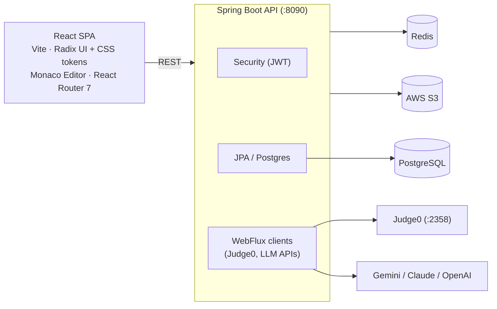

# TDTUOJ — Online Judging System for Competitive Programming

> **Monorepo root**: `d:\OJ`
> **Backend**: `TDTUOJ_backend/` — Spring Boot 3.5 (Java 21, Maven)
> **Frontend**: `tdtuoj_frontend/` — React 19 + Vite 7 (JSX, no TypeScript)

---

## Quick Start

```bash
# Backend (requires PostgreSQL on :5431, Redis on :6379, Judge0 on :2358)
cd TDTUOJ_backend
./mvnw spring-boot:run          # starts on :8090

# Frontend
cd tdtuoj_frontend
npm install
npm run dev                     # starts on :5173 (Vite default)
```

Environment variables live in `TDTUOJ_backend/.env` (loaded via `spring-dotenv`).

---

## Architecture Overview



---

## Backend (`TDTUOJ_backend/`)

### Tech Stack

| Layer         | Technology                                              |
|---------------|---------------------------------------------------------|
| Framework     | Spring Boot 3.5.6, Java 21                              |
| Build         | Maven (`mvnw`)                                          |
| Database      | PostgreSQL (driver: `org.postgresql.Driver`)             |
| Cache         | Redis (`spring-boot-starter-data-redis`)                |
| ORM           | Spring Data JPA + Hibernate (`ddl-auto: update`)        |
| Auth          | JWT (`jjwt 0.13.0`) + Spring Security 6                 |
| File Storage  | AWS S3 (`software.amazon.awssdk:s3`)                    |
| Code Execution| Judge0 CE (self-hosted, `http://localhost:2358`)         |
| AI/LLM        | Gemini API (via WebFlux `WebClient`)                    |
| PDF Parsing   | Apache PDFBox 3.0                                       |
| Excel Export  | Apache POI 5.2                                          |
| API Docs      | SpringDoc OpenAPI (`/swagger-ui/`, `/v3/api-docs/`)     |
| Monitoring    | Spring Actuator (`/actuator/**`)                        |
| Mapping       | ModelMapper 3.2, Lombok 1.18                            |
| Env           | `spring-dotenv` (reads `.env` file)                     |

### Package Structure

Base package: `com.oj.TDTUOJ`

```
com.oj.TDTUOJ
├── TdtuojApplication.java          # Main entry point
├── common/
│   ├── aws/                        # S3 upload/download (AwsS3Service)
│   ├── config/                     # AsyncConfig, ModelMapperConfig, RedisConfig, RoleInitializer
│   ├── enums/                      # Shared enums (see below)
│   ├── exceptions/                 # GlobalExceptionHandler, custom exceptions
│   ├── response/                   # Response<T> wrapper
│   ├── security/                   # SecurityConfig, AuthFilter, JwtUtils, CorsConfig
│   └── utils/                      # ProblemSlugUtils
├── user/                           # User CRUD, profile, auth
├── role/                           # Role entity & management
├── problem/                        # Problem CRUD (public + private/lecturer repo)
├── problemTag/                     # Tag management for problems
├── problemComment/                 # Threaded comment system with voting
├── problemFavorite/                # Favorite/bookmark problems
├── problemAI/                      # AI-powered PDF extraction & test-case generation
├── testcase/                       # Test case management (linked to problems)
├── submission/                     # Submission CRUD + async judging worker
│   └── worker/                     # SubmissionWorker (async Judge0 polling)
├── contest/                        # Contest CRUD, registration, leaderboard, monitor
├── organization/                   # Organization + membership management
├── lab/                            # Lab assignments within organizations
├── hintLLM/                        # AI hint generation (Gemini) — hint-only, guarded
├── judge0/                         # Judge0 HTTP client (WebClient)
├── visualizer/                     # Data structure visualizer (runtime tracing)
│   ├── service/tracer/             # Language tracers (Python, Java, C/C++, C#, JS) + BraceSynthesizer, StructCodegen
│   └── service/classifier/         # LLM variable classifier (GeminiVariableClassifier + Noop fallback)
├── userDailyActivity/              # Daily activity heatmap tracking
└── userStatistics/                 # Solved count, rating history, language stats
```

### Key Enums (`common/enums/`)

| Enum                        | Values                                                      |
|-----------------------------|-------------------------------------------------------------|
| `ProblemDifficulty`         | EASY, MEDIUM, HARD                                          |
| `SubmissionLanguage`        | C, CPP, JAVA, PYTHON, CSHARP, JAVASCRIPT                   |
| `SubmissionStatus`          | PENDING, RUNNING, COMPLETED                                 |
| `SubmissionVerdict`         | AC, WA, CE, TLE, MLE, SF, IE                               |
| `ContestStyle`              | ICPC, IOI                                                   |
| `ContestStatus`             | UPCOMING, ONGOING, ENDED                                    |
| `ContestParticipationType`  | CONTESTANT, VIRTUAL                                         |
| `ContestRegistrationStatus` | PENDING, APPROVED, REJECTED, CANCELLED                      |
| `OrganizationMemberRole`    | OWNER, ADMIN, MEMBER                                        |
| `InvitationStatus`          | PENDING, ACCEPTED, REJECTED, EXPIRED                        |
| `VisualizerMode`            | AUTO, MANUAL                                                |
| `VoteType`                  | UPVOTE, DOWNVOTE                                            |

### Module Convention (Controller → Service → Repository)

Every domain module follows this structure:
```
module/
├── controller/     # REST controllers (@RestController)
├── dto/            # Data Transfer Objects (request/response)
├── entity/         # JPA entities (@Entity)
├── repository/     # Spring Data JPA repositories
└── service/        # Service interfaces + *Impl classes
```

### API Response Envelope

All endpoints return `Response<T>`:
```java
public class Response<T> {
    private int statusCode;      // HTTP status code
    private String message;      // Human-readable message
    private T data;              // Payload
    private Map<String, Serializable> meta;  // Pagination metadata, etc.
}
```

### Security Model

- **Stateless JWT** — no server-side sessions, token stored in `localStorage` on the client.
- **Roles**: `ADMIN`, `CREATOR` (lecturer), `PARTICIPANT` (student).
- **Public endpoints**: `/api/auth/**`, `/api/problems/**`, `/api/users/**`, `/api/contests/**`, `/api/organizations/**`, `/api/status/**`, `/api/files/**`, Swagger, Actuator.
- **Method-level security**: `@PreAuthorize` annotations on service/controller methods.
- **Password hashing**: BCrypt.

### Key Integrations

| System    | Purpose                       | How                                          |
|-----------|-------------------------------|----------------------------------------------|
| Judge0    | Code execution & judging      | `WebClient` POST to `localhost:2358`          |
| Gemini    | AI hints, PDF→problem, test gen | `WebClient` to Gemini REST API             |
| AWS S3    | Avatar & file storage         | `AwsS3ServiceImpl` with AWS SDK v2           |
| Redis     | Caching                       | `spring-boot-starter-data-redis`             |

### Running the Backend

```bash
cd TDTUOJ_backend

# Prerequisites:
#   PostgreSQL on localhost:5431, db: tdtuoj, user: admin/admin123
#   Redis on localhost:6379
#   Judge0 on localhost:2358

# Run
./mvnw spring-boot:run

# Build JAR
./mvnw clean package -DskipTests
```

Server starts on **port 8090**.

---

## Frontend (`tdtuoj_frontend/`)

### Tech Stack

| Layer        | Technology                                   |
|--------------|----------------------------------------------|
| Framework    | React 19 + Vite 7                            |
| Language     | JavaScript (JSX, no TypeScript)              |
| Routing      | React Router v7 (`react-router-dom`)         |
| UI Library   | Radix UI primitives (dialog, dropdown, tabs, tooltip) + hand-rolled CSS design system — **no Chakra, no Bootstrap** |
| Code Editor  | Monaco Editor (`@monaco-editor/react`, + `monaco-vim`) |
| HTTP         | Axios                                        |
| Markdown     | `react-markdown` + `@uiw/react-md-editor`    |
| Icons        | FontAwesome + Lucide React                   |
| Charts       | recharts + d3                                |
| Animation    | `motion`                                     |
| Syntax HL    | highlight.js                                 |

### Directory Structure

```
tdtuoj_frontend/src/
├── App.jsx                     # Root component with all routes
├── main.jsx                    # React DOM entry point
├── index.css                   # Global CSS (~39KB — "THE ARENA" design-token system)
├── App.css                     # App-level overrides
├── assets/                     # Static assets
├── styles/
│   └── authStyle.css           # Auth page styles
├── services/
│   ├── ApiService.js           # Centralized API client (static class, Axios)
│   └── Guard.jsx               # Route guards (AdminRoute, AdminOrCreatorRoute, ParticipantRoute)
├── context/                    # React context providers (currently empty)
└── components/
    ├── common/                 # NavBar, Footer, GlobalClockBar, ToastMessage, ConfirmDialog, DateTimePicker, AvatarUploadModal
    ├── auth/                   # LoginPage, RegisterPage (supports Google OAuth via GIS)
    ├── home/                   # HomePage
    ├── problems/               # ProblemPage, ProblemDetailsPage, HintPanel, MyProblemsPage, MyProblemFormPage
    ├── users/                  # UserPage (leaderboard)
    ├── profile/                # ProfilePage, EditProfilePage, ChangePasswordPage
    ├── contests/               # ContestPage, ContestDetailPage, ContestProblemPage
    ├── organizations/          # OrganizationPage, OrganizationDetailPage, LabFormPage, LabDetailPage, LabProgressPage, LabProblemPage
    ├── admin/                  # AdminLayout, AdminSideBar, AdminProblemPage/FormPage, AdminContestPage/FormPage/MonitorPage, AdminUserPage/EditUserPage, AdminProblemTagPage, AdminOrganizationPage
    ├── codeEditor/             # Monaco-based code editor wrapper (settings persisted to localStorage)
    └── visualizer/             # VisualizerModal, VisualizerPlayer
        ├── inference/          # materialize.js (heap+ref frames → JS values), inferShape.js (kind classifier)
        └── renderers/          # ArrayRenderer, StackRenderer, QueueRenderer, LinkedListRenderer, TreeRenderer, GraphRenderer, MatrixRenderer, MemoryModelRenderer (fallback), RendererFactory
```

### Routing Summary

| Path                                            | Component              | Access         |
|-------------------------------------------------|------------------------|----------------|
| `/home`                                         | HomePage               | Public         |
| `/login`, `/register`                           | LoginPage, RegisterPage| Public         |
| `/problems`                                     | ProblemPage            | Public         |
| `/problems/:slug`                               | ProblemDetailsPage     | Public         |
| `/contests`                                     | ContestPage            | Public         |
| `/contests/:slug`                               | ContestDetailPage      | Public         |
| `/contests/:contestSlug/problems/:problemSlug`  | ContestProblemPage     | Public         |
| `/organizations`                                | OrganizationPage       | Public         |
| `/organizations/:slug`                          | OrganizationDetailPage | Public         |
| `/organizations/:orgSlug/labs/*`                | Lab pages              | Public         |
| `/users`                                        | UserPage               | Public         |
| `/users/:username`                              | ProfilePage            | Public         |
| `/profile`                                      | EditProfilePage        | Authenticated  |
| `/change-password`                              | ChangePasswordPage     | Authenticated  |
| `/admin/*`                                      | Admin panel            | Admin/Creator  |
| `/admin/users/*`                                | User management        | Admin only     |

### API Client Pattern

`ApiService.js` is a **static utility class** — no instantiation needed:
```js
// Token management
ApiService.saveToken(token);
ApiService.getToken();
ApiService.isAuthenticated();
ApiService.isAdmin();

// API calls
const data = await ApiService.getAllProblems({ limit: 10, offset: 0 });
const data = await ApiService.createSubmission({ problemId, sourceCode, language });
```

- Base URL: `http://localhost:8090/api`
- Judge0 direct URL: `http://localhost:2358`
- Auth token is stored in `localStorage` and attached via `Authorization: Bearer <token>` header.

### Running the Frontend

```bash
cd tdtuoj_frontend
npm install
npm run dev       # Dev server on :5173
npm run build     # Production build to dist/
npm run preview   # Preview production build
```

---

## Data Structure Visualizer

A standout feature that instruments user code to trace variable state at each step.

### Backend Flow
1. User submits code + language to `POST /api/visualize`.
2. `VisualizerServiceImpl` delegates to a language-specific tracer in `visualizer/service/tracer/` (`PythonTracer`, `JavaTracer`, `CppTracer`, `CTracer`, `CSharpTracer`, `JsTracer`; `BraceSynthesizer` normalizes brace styles first). Tracers rewrite the source to emit per-line frames in a heap+reference format (`locals: {name: value | "@heapId"}`, `heap: {...}`).
3. Instrumented code runs on Judge0; frames are parsed from stderr. Note: the visualizer uses Judge0 C++ language id **76** while `Judge0Service` uses **54** — intentional, different compiler configs.
4. A best-effort LLM step (`GeminiVariableClassifier`, ~3s budget, `NoopVariableClassifier` fallback) labels variable kinds.

### Frontend Pipeline
1. `inference/materialize.js` — turns heap+reference frames into plain JS values.
2. `inference/inferShape.js` — heuristic classifier per variable (array/matrix/stack/queue/linkedlist/tree/graph/memory). Precedence: user override > LLM label (confidence ≥ 0.7) > heuristic rule.
3. `RendererFactory` dispatches by kind:
   - `ArrayRenderer` — 1D arrays
   - `MatrixRenderer` — 2D arrays
   - `StackRenderer`, `QueueRenderer` — LIFO/FIFO structures
   - `LinkedListRenderer` — singly linked lists
   - `TreeRenderer` — binary trees
   - `GraphRenderer` — adjacency-based graphs
   - `MemoryModelRenderer` — fallback for unrecognized structures

---

## AI Features

| Feature              | Endpoint                        | LLM         | Description                                    |
|----------------------|---------------------------------|-------------|-------------------------------------------------|
| Problem Hints        | `POST /api/hints`               | Gemini      | Guarded — only provides hints for the given problem, rejects off-topic queries |
| PDF Extraction       | `POST /api/problem-ai/extract-pdf` | Gemini   | Extracts problem statement from PDF uploads     |
| Test Case Generation | `POST /api/problem-ai/generate-test-cases` | Gemini | AI-generates test cases from problem text  |

---

## Conventions & Patterns

### Backend
- **Lombok everywhere**: `@Data`, `@Builder`, `@RequiredArgsConstructor`, `@AllArgsConstructor`, `@NoArgsConstructor`.
- **ModelMapper** for entity ↔ DTO conversion (configured in `ModelMapperConfig`).
- **`@ControllerAdvice`** with `GlobalExceptionHandler` for uniform error responses.
- **Custom exceptions**: `NotFoundException`, `BadRequestException`, `UnauthorizedAccessException`.
- **Async**: `@EnableAsync` + `AsyncConfig` with custom thread pool for submission judging.
- **Slugs**: Problems and contests use URL slugs (generated via `ProblemSlugUtils`).
- **`isPublic` guard**: All public-facing queries must filter by `isPublic = true` for problems that support public/private visibility.
- **Role initialization**: `RoleInitializer` seeds ADMIN, CREATOR, PARTICIPANT roles on startup.

### Frontend
- **No TypeScript** — plain JSX throughout.
- **Styling**: Global CSS design system in `index.css` (~39KB, "THE ARENA" tokens: dark carbon palette + TDTU gold/navy; legacy `--cyan*` vars alias `--primary`) + `authStyle.css`. Radix UI for interactive primitives. **No Chakra UI, no Bootstrap.**
- **State management**: Local `useState`/`useEffect` — no Redux or Zustand.
- **Toast notifications**: Custom `ToastProvider` context wrapping the app.
- **Route guards**: `AdminRoute`, `AdminOrCreatorRoute`, `ParticipantRoute` in `Guard.jsx`.
- **Single API service file**: All HTTP calls centralized in `ApiService.js`.

---

## External Services Required

| Service      | Default URL / Port         | Notes                                          |
|--------------|----------------------------|-------------------------------------------------|
| PostgreSQL   | `localhost:5431`           | Database: `tdtuoj`, user: `admin`               |
| Redis        | `localhost:6379`           | Used for caching                                |
| Judge0 CE    | `localhost:2358`           | Self-hosted code execution engine               |
| AWS S3       | `ap-southeast-1`           | Bucket: `tdtu-oj`, for file/avatar storage      |
| Gemini API   | Google AI API              | For hints, PDF extraction, test case generation  |

---

## Build Verification Rule

**Before finishing any task that modifies backend or frontend code, you MUST run the build and confirm it passes. Do not report the task as done until the build succeeds.**

- **Frontend**: run `npm run build` inside `tdtuoj_frontend/`. Fix all errors before finishing.
- **Backend**: run `./mvnw compile -q` inside `TDTUOJ_backend/`. Fix all compilation errors before finishing.

If the build cannot be run (services unavailable, etc.), explicitly state this and warn the user to verify manually.

---

## Common Tasks

### Adding a New Backend Module
1. Create package under `com.oj.TDTUOJ.<module>/`.
2. Add sub-packages: `entity/`, `dto/`, `repository/`, `service/`, `controller/`.
3. Create JPA entity with `@Entity`, `@Data`, `@Builder`.
4. Create Spring Data `JpaRepository`.
5. Create service interface + `*Impl` class.
6. Create `@RestController` with appropriate `@RequestMapping`.
7. Register public endpoints in `SecurityConfig` if needed.

### Adding a New Frontend Page
1. Create component in `src/components/<section>/`.
2. Add API methods to `ApiService.js` if new endpoints are needed.
3. Add route in `App.jsx` (use guards for protected routes).
4. Add styles to `index.css` or create a new CSS file in `styles/`.

### Adding a New Visualizer Renderer
1. Create `<DataStructure>Renderer.jsx` in `components/visualizer/renderers/`.
2. Register in `RendererFactory.jsx`.
3. Ensure the backend instrumentor emits the correct `__TRACE__` format for the new data type.
