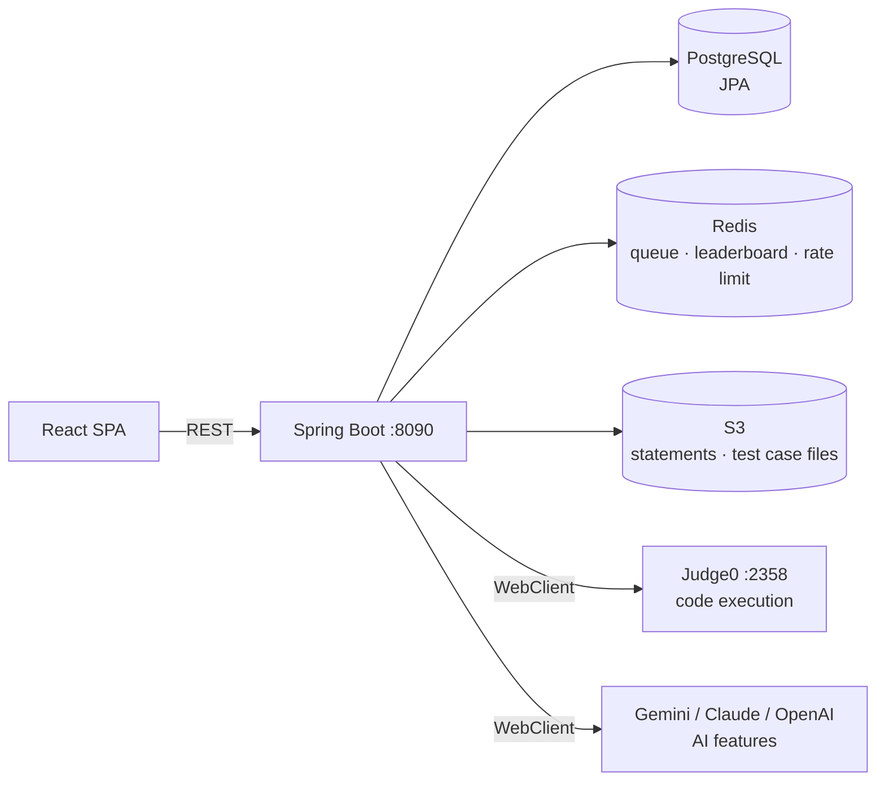

# TDTUOJ — Codebase Reading Guide

A guided path through the codebase for someone reading it for the first time.
Backend: `TDTUOJ_backend/` (Spring Boot 3.5, Java 21, ~232 Java files, ~21k LOC).
Frontend: `tdtuoj_frontend/` (React 19 + Vite 7, plain JSX, ~28k LOC).

> Read this top-to-bottom the first time; afterwards use it as a lookup table.

---

## 0. The 10-minute mental model

TDTUOJ is an online judge: users submit code for problems, the backend queues the
submission in Redis, a background worker sends it to **Judge0** (a self-hosted code
execution engine on `:2358`) test case by test case, and writes back a verdict
(AC/WA/TLE/...). On top of that core loop sit contests (ICPC/IOI scoring, live
leaderboards), organizations with classroom "labs", AI features (hints, PDF→problem
extraction, test generation), and a code **visualizer** that instruments user code,
runs it on Judge0, and animates the data structures frame by frame.

Key architectural facts to hold in your head:

- **Judging is asynchronous.** `POST /api/submissions` returns `202` with a queue
  position; a scheduled worker polls a Redis list every 100 ms and judges. The
  frontend polls `GET /api/submissions/{id}/status`.
- **Redis has three jobs**: submission queue + cooldowns, live contest leaderboard
  (ZSETs), and rate-limit buckets (bucket4j).
- **S3 holds the actual content** — problem statements and test case input/expected
  files are fetched from S3 at judge time, not stored in the DB.
- **Auth is stateless JWT** (HS256, 30-day expiry), token in `localStorage`,
  roles: `ADMIN`, `CREATOR` (lecturer), `PARTICIPANT` (student).
- **Every endpoint returns the same envelope**: `Response<T>` =
  `{statusCode, message, data, meta}`.

---

## 1. Backend reading path

All paths relative to `TDTUOJ_backend/src/main/java/com/oj/TDTUOJ/` unless noted.
Layout is per-domain vertical slices: `<domain>/controller|dto|entity|repository|service`,
shared infrastructure under `common/`.

### Step 1 — The skeleton (read these first, in order)

| File | Why |
|---|---|
| `TdtuojApplication.java` | Entry point. |
| `../resources/application.yml` | All config in one place: DB, Redis, S3, Judge0 URL, LLM API keys, rate-limit tiers. |
| `common/security/SecurityConfig.java` | Filter chain, public endpoints, method security. |
| `common/security/AuthFilter.java` | How a JWT becomes a `SecurityContext` (via `JwtUtils` + `CustomUserDetailsService`). |
| `common/ratelimit/RateLimitFilter.java` | bucket4j token buckets per tier/IP/user (tiers in `application.yml`). |
| `common/response/Response.java` | The universal response envelope. |
| `common/exceptions/GlobalExceptionHandler.java` | How exceptions become JSON errors. |
| `common/config/AsyncConfig.java` | Scheduler pool (size 2 — matched to Judge0 worker count) that drives judging. |
| `common/config/RedisConfig.java` | RedisTemplate (String keys / JSON values) + bucket4j proxy manager. |

Request lifecycle: `AuthFilter` → `RateLimitFilter` → `@RestController` → service
interface + `*ServiceImpl` → Spring Data repository → `Response<T>`.

### Step 2 — The heart: submission judging flow

Read these in order; this is the core of the whole system:

1. `submission/controller/SubmissionController.java` — `POST /api/submissions`.
2. `submission/service/SubmissionServiceImpl.java` (~306 lines) — cooldown check,
   contest/lab guards, saves as `PENDING`, enqueues to Redis, returns `202`.
3. `submission/service/SubmissionQueueService.java` — Redis list
   `submissions:queue`, position keys, 5 s cooldown keys, queue-depth metric.
4. `submission/worker/SubmissionWorker.java` — `@Scheduled(fixedDelay=100)` dequeue loop.
5. `submission/service/SubmissionJudgeService.java` (~311 lines) — the judge:
   loads test cases, reads input/expected from S3, calls Judge0 per test case,
   stops on first failure, writes verdict/time/memory, updates user activity,
   statistics, points (first-ever AC only), and the ICPC contest leaderboard
   (penalty = minutesFromStart + 20 × wrong attempts).
6. `judge0/Judge0Service.java` — WebClient POST to
   `${judge0.api.url}/submissions?base64_encoded=true&wait=true`; maps Judge0
   status id → `SubmissionVerdict` (3=AC, 4=WA, 5=TLE, 6=CE, 7–12=SF).

### Step 3 — Domain modules (read as needed)

The biggest `*ServiceImpl` in each module is where the business logic lives:

| Module | Purpose | Key file (lines) |
|---|---|---|
| `problem/` | Problem CRUD, slugs, public/private visibility, S3 statements | `ProblemServiceImpl.java` (703 — biggest file) |
| `lab/` | Classroom assignments inside orgs, deadlines, progress | `LabServiceImpl.java` (656) |
| `contest/` | Contests, registration, ICPC leaderboard, Elo-style rating | `ContestServiceImpl.java` (655), `ContestLeaderboardService.java` (490, Redis ZSET) |
| `organization/` | Orgs, member roles, invitations | `OrganizationServiceImpl.java` (518) |
| `user/` | Auth, Google login, profiles, admin user mgmt | `UserServiceImpl.java` (374), `AuthServiceImpl.java` |
| `testcase/` | Per-problem test cases (files in S3) | `TestCaseServiceImpl.java` |
| `problemComment/` | Threaded comments with up/down votes | `ProblemCommentServiceImpl.java` |
| `problemTag/`, `problemFavorite/` | Tags, bookmarks | small — skim |
| `hintLLM/` | AI hints, multi-provider | `HintService.java` + `GeminiHintService`/`ClaudeHintService`/`OpenAiHintService` |
| `problemAI/` | PDF→problem extraction, AI test-case generation | `GeminiProblemAIService.java` |
| `visualizer/` | Code tracing for the frontend visualizer | see Step 4 |
| `dashboard/`, `status/` | Admin stats, Judge0 health | `*ServiceImpl.java` |
| `userDailyActivity/`, `userStatistics/` | Heatmap + solve stats (written by the judge flow) | `*ServiceImpl.java` |

### Step 4 — Visualizer backend (only if touching that feature)

`visualizer/service/VisualizerServiceImpl.java` (278) rewrites user source with a
per-language tracer, runs it on Judge0, and parses trace frames from stderr.
Tracers live in `visualizer/service/tracer/`: `CppTracer` (603), `CTracer` (570),
`CSharpTracer` (553), `BraceSynthesizer` (488), `JavaTracer` (412), `PythonTracer`,
`JsTracer` (JS uses bundled `resources/visualizer/acorn.js` + `js-instrument.js`).
An LLM step (`GeminiVariableClassifier`) labels variables best-effort with a 3 s
budget and a `NoopVariableClassifier` fallback.

Gotcha: the visualizer uses Judge0 language id **76** for C++ while `Judge0Service`
uses **54** — different compiler configs, intentional.

### Backend gotchas

- `ddl-auto: update` — schema auto-migrates from entities; there is **no**
  Flyway/Liquibase. Entity changes mutate the schema on next boot.
- Role checks are split: `@PreAuthorize` on controllers **and** manual
  `user.getRoles()...equalsIgnoreCase("ADMIN")` checks inside services.
- Points are awarded only on a user's **first-ever AC** of a problem, guarded
  against double-counting in `SubmissionJudgeService`.
- Micrometer + Prometheus are fully wired (all actuator endpoints exposed);
  custom metrics for queue depth and judge duration/verdicts.
- `tools/viz-test/` contains committed compiled artifacts — ignore when reading.
- Tests under `src/test/java/` mirror the services and read like behavioral specs —
  `SubmissionJudgeServiceTest`, `ContestServiceImplTest`, `TracerInstrumentationTest`
  are the most instructive.

---

## 2. Frontend reading path

All paths relative to `tdtuoj_frontend/src/`.

### Step 1 — The skeleton

1. `main.jsx` — trivial: mounts `<App/>`, imports `index.css`.
2. `App.jsx` (~117 lines) — **the map of the whole app.** Provider nesting is:
   `<ToastProvider>` → `RateLimitEventHandler` → `<BrowserRouter>` → NavBar +
   GlobalClockBar + `<Routes>` + footer. Admin routes nested under `/admin` behind
   `AdminOrCreatorRoute` (user management further behind `AdminRoute`).
3. `services/ApiService.js` (877 lines, ~88 static methods) — the entire API
   contract. Single static class; token/roles in `localStorage`; `getHeader()`
   builds the Bearer header. Methods grouped by `// ─── … ───` banners
   (Auth, Problems, Submissions, Contests, Organizations, Labs, LLM, Visualizer, …).
   A module-level axios interceptor catches HTTP 429 and dispatches a
   `window` CustomEvent `api:rate-limited` — that's how the global rate-limit
   toast works.
4. `services/Guard.jsx` (~38 lines) — route guards (`AdminRoute`,
   `AdminOrCreatorRoute`, `CreatorRoute`, `ParticipantRoute`). They read roles from
   `localStorage` and redirect to `/login`. **Cosmetic only** — real authorization
   is server-side.
5. `index.css` (~1,300 lines) — the design system ("THE ARENA"): CSS custom
   properties (dark carbon palette + TDTU gold/navy, verdict colors) plus utility
   classes. Skim the `:root` block. Legacy `--cyan*` vars alias `--primary` (gold)
   from an old recolor.

### Step 2 — State management (there almost isn't any)

- No Redux/Zustand. `src/context/` **exists but is empty** — the only React context
  is `ToastProvider`/`useToast`, co-located in `components/common/ToastMessage.jsx` (303).
- Everything else: local `useState`/`useEffect` per page + `ApiService` on mount.
- `localStorage` is the de-facto global state: auth token/roles (`ApiService`),
  theme (`ThemeToggle.jsx`, key `arena-theme`), editor settings (`codeEditor/CodeEditor.jsx`),
  split-pane sizes (`common/SplitPane.jsx`).
- Cross-component signaling uses `window` CustomEvents (`api:rate-limited`)
  instead of context.

### Step 3 — Component map (`components/`)

| Folder | Purpose | Start with |
|---|---|---|
| `problems/` | Problem list/detail/solve, lecturer "My Problems" repo, AI hints & analysis | `ProblemDetailsPage.jsx` (2011 — **largest file in repo**, the core solving screen) |
| `contests/` | Contest browse + in-contest solving | `ContestProblemPage.jsx` (756) |
| `admin/` | Admin/creator back-office (CRUD forms, dashboard, live monitor) | `AdminContestMonitorPage.jsx` (1835) |
| `organizations/` | Orgs + labs (classroom assignments) | `OrganizationDetailPage.jsx` (718), `LabProblemPage.jsx` (716) |
| `profile/` | Profile view/edit/password | `ProfilePage.jsx` (1303) |
| `common/` | Shared UI kit — 26 files: NavBar, toasts, dialogs, pagination, search | `ToastMessage.jsx`, `GlobalSearchBar.jsx` (342) |
| `codeEditor/` | Monaco wrapper + language selector, settings persisted to localStorage | `CodeEditor.jsx` (346) |
| `auth/` | Login/register (Google OAuth via GIS) | `RegisterPage.jsx` (290) |
| `home/`, `users/`, `status/` | Landing, user directory, global judge feed | `HomePage.jsx` (504), `UserPage.jsx` (381), `JudgeStatusPage.jsx` (381) |
| `visualizer/` | See Step 4 | — |

### Step 4 — Visualizer frontend (read in this order)

Data flow: user code → backend traces it (heap+reference frames) → frontend
materializes values → infers each variable's shape → renders animated frames.

1. `visualizer/inference/materialize.js` — turns the backend frame format
   (`locals: {name: 5 | "str" | "@heapId"}`, `heap: {...}`) into plain JS values.
2. `visualizer/inference/inferShape.js` (577) — heuristic classifier: which kind
   (array/matrix/stack/queue/linkedlist/tree/graph/memory) is each variable.
   Precedence: user override > LLM label (confidence ≥ 0.7) > heuristic rule.
3. `visualizer/renderers/RendererFactory.jsx` — `switch(frame.type)` → renderer
   component; `MemoryModelRenderer.jsx` (346) is the fallback.
4. `visualizer/VisualizerPlayer.jsx` (730) — playback engine (play/loop/step,
   per-variable renderer choice + "view as" override).
5. `visualizer/VisualizerModal.jsx` (547) — entry UI: Monaco viewer with
   current/next-line highlights, calls the backend, feeds frames to the player.

The plan document `feat/VISUALIZER-REFACTOR-PLAN.md` (repo root) is the design
spec both sides reference.

### Frontend gotchas

- **CLAUDE.md is stale on styling**: there is no Chakra UI and no Bootstrap in
  the app. UI = hand-rolled CSS (`index.css`) + Radix primitives
  (`@radix-ui/react-dialog|dropdown-menu|tabs|tooltip`) + lucide/FontAwesome icons +
  recharts/d3 charts + `motion` animations.
- `ApiService` talks to **three** backends: main API, Judge0 directly, and LLM endpoints.
- Toasts and Monaco highlights inject `<style>` into `document.head` at runtime —
  not everything lives in `index.css`.
- Heavy inline `style={{}}` objects, especially in visualizer renderers.

---

## 3. Suggested first-week reading order

1. **Day 1 — skeleton**: backend Step 1 files + frontend `App.jsx` + `ApiService.js`.
   Goal: trace one request (e.g. login) from browser to DB and back.
2. **Day 2 — the judge**: backend Step 2 (submission flow) end-to-end, then open
   `problems/ProblemDetailsPage.jsx` and find where it submits and polls status.
3. **Day 3 — contests**: `ContestServiceImpl`, `ContestLeaderboardService`,
   `SubmissionJudgeService.updateContestLeaderboard`, frontend `ContestProblemPage.jsx`
   and `AdminContestMonitorPage.jsx`.
4. **Day 4 — orgs & labs**: `OrganizationServiceImpl`, `LabServiceImpl`, frontend
   `organizations/` folder.
5. **Day 5 — visualizer + AI**: backend Step 4, frontend Step 4, `hintLLM/`, `problemAI/`.

Run it locally while reading (see `CLAUDE.md` Quick Start): PostgreSQL `:5431`,
Redis `:6379`, Judge0 `:2358`, backend `:8090`, frontend `:5173`.
