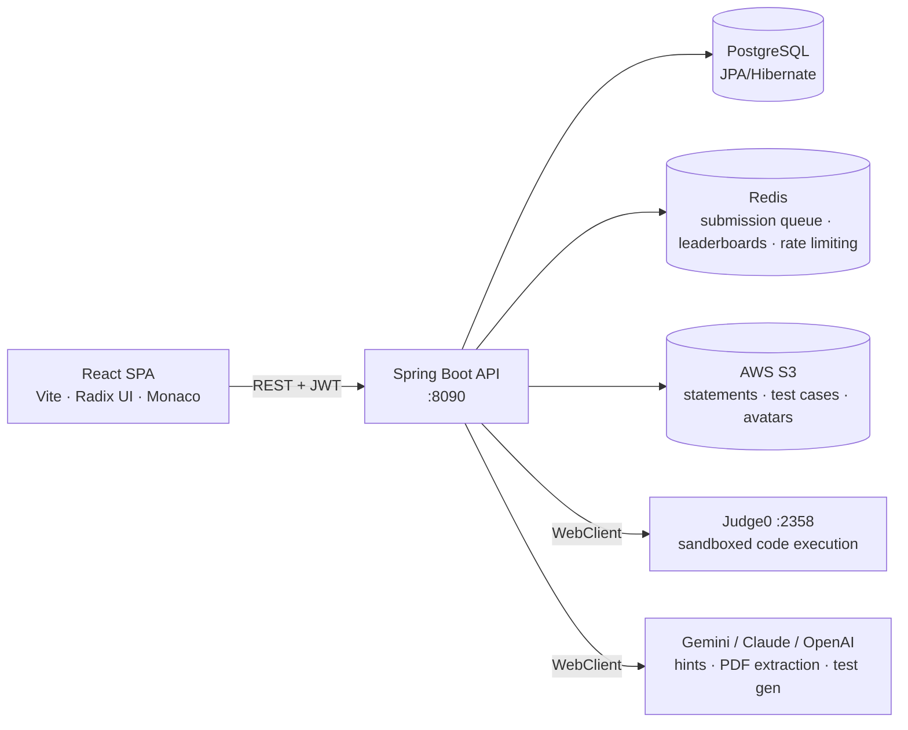

# TDTUOJ — Online Judge for Competitive Programming

An online judging platform built for TDTU: solve algorithm problems, compete in
contests, run classroom labs, and visualize how your code manipulates data
structures — step by step.

| | |
|---|---|
| **Backend** | [`TDTUOJ_backend/`](TDTUOJ_backend/) — Spring Boot 3.5, Java 21, PostgreSQL, Redis, Judge0 |
| **Frontend** | [`tdtuoj_frontend/`](tdtuoj_frontend/) — React 19 + Vite 7 (plain JSX), Radix UI, Monaco Editor |

## Features

- **Problems** — public problem archive with tags, difficulty, favorites, threaded
  comments with voting, and a private lecturer repository.
- **Judging** — asynchronous pipeline: submissions queue in Redis, a background
  worker executes them test case by test case on a self-hosted
  [Judge0](https://judge0.com/) instance, verdicts (AC/WA/TLE/MLE/RE/CE) stream
  back with time/memory stats. Languages: Python, Java, C, C++.
- **Contests** — ICPC and IOI scoring styles, public/private/organization
  participation, live Redis-backed leaderboards, Elo-style rating, and an admin
  monitor for proctoring.
- **Organizations & Labs** — classroom groups with member roles, invitations, lab
  assignments, deadlines, and per-student progress tracking.
- **Data structure visualizer** — instruments user code with per-language tracers
  (Python, Java, C/C++, C#, JS), runs it on Judge0, and animates arrays, matrices,
  stacks, queues, linked lists, trees, and graphs frame by frame.
- **AI assistance** — guarded problem hints, PDF → problem statement extraction,
  and AI test-case generation (Gemini; Claude/OpenAI providers wired for hints).
- **Profiles & stats** — activity heatmap, solved counts, rating history,
  language breakdown, Excel export for lecturers.

## Quick start

Prerequisites: Java 21, Node 20+, and locally running services —
PostgreSQL on `:5431` (db `tdtuoj`), Redis on `:6379`, Judge0 CE on `:2358`.

```bash
# Backend — http://localhost:8090
cd TDTUOJ_backend
./mvnw spring-boot:run

# Frontend — http://localhost:5173
cd tdtuoj_frontend
npm install
npm run dev
```

Backend environment variables (DB credentials, S3, JWT secret, LLM API keys) live
in `TDTUOJ_backend/.env`, loaded via `spring-dotenv`. See
`TDTUOJ_backend/src/main/resources/application.yml` for the full config surface.

API docs: `http://localhost:8090/swagger-ui/` once the backend is up.

## Architecture



- Stateless JWT auth; roles `ADMIN`, `CREATOR` (lecturer), `PARTICIPANT` (student).
- Every endpoint returns a uniform `Response<T>` envelope.
- Micrometer + Prometheus metrics exposed via Actuator (Grafana stack in
  [`monitoring/`](monitoring/), k6 load tests in [`tests/k6/`](tests/k6/)).

## Repository layout

```
TDTUOJ_backend/     Spring Boot API (domain-sliced packages under com.oj.TDTUOJ)
tdtuoj_frontend/    React SPA
monitoring/         Prometheus + Grafana stack
tests/k6/           k6 load & rate-limit test suites
deploy/             Deployment scripts & notes
```

## Documentation

- **New to the codebase?** Start with [READING-GUIDE.md](READING-GUIDE.md) — a
  guided path through both apps with suggested reading order.
- **Deployment**: [deploy/README.md](deploy/README.md).
