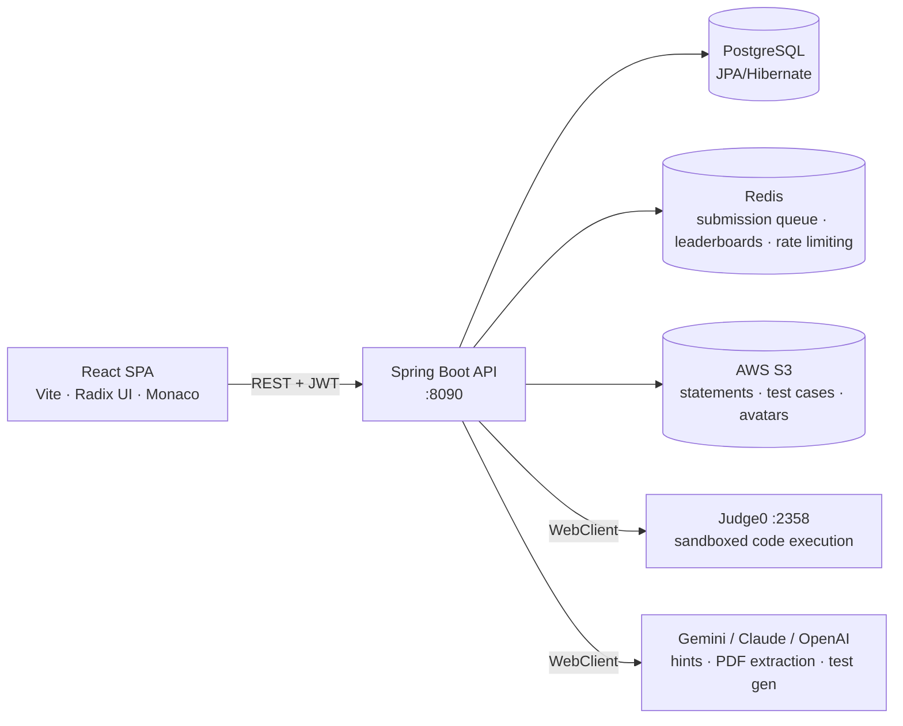

# TDTUOJ — Online Judge for Competitive Programming

> Bachelor thesis project · Software Engineering, Ton Duc Thang University (TDTU) · Graded **9.0/10**

An online judging platform built for TDTU: solve algorithm problems, compete in contests, run classroom labs, and **see how your code manipulates data structures, step by step**.

[](https://youtu.be/BXI2cNY7Gv4)

▶️ **[Watch the demo on YouTube](https://youtu.be/BXI2cNY7Gv4)**


| | |
|---|---|
| **Backend** | [`TDTUOJ_backend/`](TDTUOJ_backend/) — Spring Boot 3.5, Java 21, PostgreSQL, Redis, Judge0 |
| **Frontend** | [`tdtuoj_frontend/`](tdtuoj_frontend/) — React 19 + Vite 7 (plain JSX), Radix UI, Monaco Editor |

## Contents

- [Highlights](#highlights)
- [Features](#features)
- [Architecture](#architecture)
- [Quick start](#quick-start)
- [Repository layout](#repository-layout)
- [Observability & testing](#observability--testing)
- [Documentation](#documentation)

## Highlights

- **Asynchronous judging pipeline** — Redis-backed queue, background workers, per-test-case verdicts executed in a sandboxed, self-hosted Judge0.
- **Data structure visualizer** — instruments user code and animates arrays, trees, graphs and more, frame by frame.
- **Built for the classroom** — organizations, lab assignments, deadlines and per-student progress, not just contests.
- **AI-assisted authoring** — guarded hints, PDF → problem statement extraction, and test-case generation.

<!-- Add 3–4 screenshots here: problem page, contest leaderboard, visualizer.
     e.g.  -->

## Features

### Problems
Public problem archive with tags, difficulty, favorites, and threaded comments with voting. Lecturers also get a private problem repository.

### Judging
Submissions are queued in Redis; a background worker runs them test case by test case on Judge0 and streams verdicts back with time and memory stats.

| Verdict | Meaning |
|---|---|
| AC | Accepted |
| WA | Wrong Answer |
| TLE | Time Limit Exceeded |
| MLE | Memory Limit Exceeded |
| RE | Runtime Error |
| CE | Compilation Error |

**Supported languages:** Python, Java, C, C++.

### Contests
- ICPC and IOI scoring styles
- Public, private, and organization-only participation
- Live Redis-backed leaderboards
- Elo-style rating system
- Admin monitor for proctoring

### Organizations & Labs
Classroom groups with member roles, invitations, lab assignments, deadlines, and per-student progress tracking.

### Data structure visualizer
Instruments your code with per-language tracers (Python, Java, C/C++, C#, JavaScript), executes it on Judge0, and animates arrays, matrices, stacks, queues, linked lists, trees, and graphs frame by frame.

### AI assistance
Guarded problem hints, PDF → problem statement extraction, and AI test-case generation. Gemini powers all three; Claude and OpenAI providers are wired in for hints.

### Profiles & stats
Activity heatmap, solved counts, rating history, language breakdown, and Excel export for lecturers.

## Architecture



- **Auth:** stateless JWT with three roles — `ADMIN`, `CREATOR` (lecturer), `PARTICIPANT` (student).
- **API contract:** every endpoint returns a uniform `Response<T>` envelope.
- **Metrics:** Micrometer + Prometheus via Actuator.

## Quick start

### Prerequisites

| Requirement | Version / port |
|---|---|
| Java | 21 |
| Node.js | 20+ |
| PostgreSQL | `:5431`, database `tdtuoj` |
| Redis | `:6379` |
| Judge0 CE | `:2358` |

### Run

```bash
# 1. Backend — http://localhost:8090
cd TDTUOJ_backend
./mvnw spring-boot:run

# 2. Frontend — http://localhost:5173
cd tdtuoj_frontend
npm install
npm run dev
```

### Configuration

Backend environment variables (DB credentials, S3, JWT secret, LLM API keys) live in `TDTUOJ_backend/.env`, loaded via `spring-dotenv`. See [`application.yml`](TDTUOJ_backend/src/main/resources/application.yml) for the full configuration surface.

> Never commit `.env` — it contains secrets.

### API docs

Once the backend is up: <http://localhost:8090/swagger-ui/>

## Repository layout

```
TDTUOJ_backend/     Spring Boot API (domain-sliced packages under com.oj.TDTUOJ)
tdtuoj_frontend/    React SPA
monitoring/         Prometheus + Grafana stack
tests/k6/           k6 load & rate-limit test suites
deploy/             Deployment scripts & notes
```

## Observability & testing

- Grafana dashboards and Prometheus config: [`monitoring/`](monitoring/)
- k6 load and rate-limit suites: [`tests/k6/`](tests/k6/)

## Documentation

- **New to the codebase?** Start with [READING-GUIDE.md](READING-GUIDE.md) — a guided path through both apps with a suggested reading order.
- **Deployment:** [deploy/README.md](deploy/README.md)

<!-- Optional: add an Author section and License.
## Author
Your Name — Software Engineering, TDTU · [LinkedIn](...) · [GitHub](...)

## License
... -->
