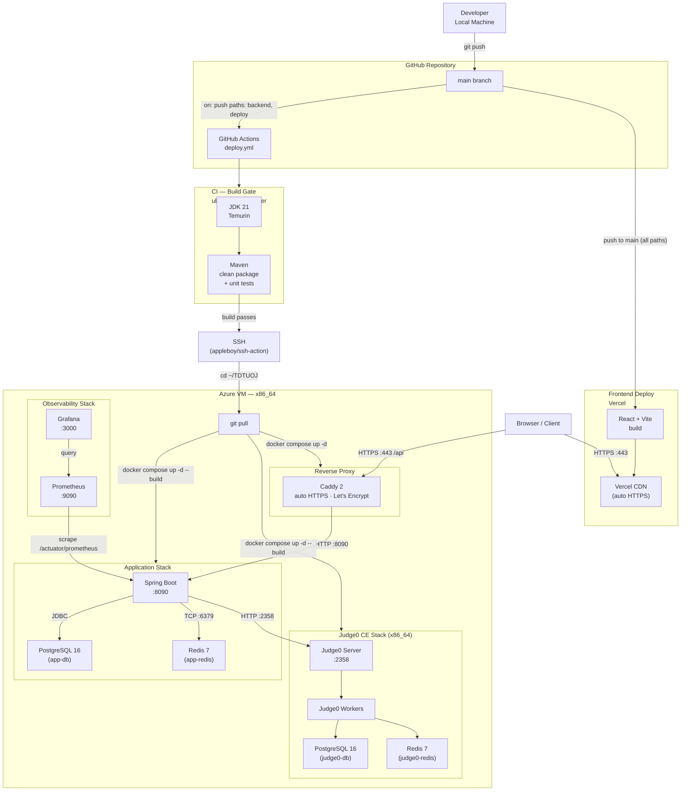

# TDTUOJ Deployment Pipeline

## Notes

| Layer | Technology | Hosted on |
|---|---|---|
| Source control & CI/CD | GitHub Actions | GitHub |
| Frontend | React + Vite | Vercel (auto-deploy on push) |
| Reverse proxy | Caddy 2 (auto TLS) | Azure VM |
| Backend | Spring Boot 3 / Java 21 | Azure VM (Docker) |
| App database | PostgreSQL 16 | Azure VM (Docker) |
| Cache / rate-limiting | Redis 7 | Azure VM (Docker) |
| Code execution | Judge0 CE 1.13.1 | Azure VM (Docker, x86_64 only) |
| Judge queue/store | PostgreSQL 16 + Redis 7 | Azure VM (Docker) |
| Metrics collection | Prometheus | Azure VM (Docker) |
| Dashboards | Grafana | Azure VM (Docker) |
