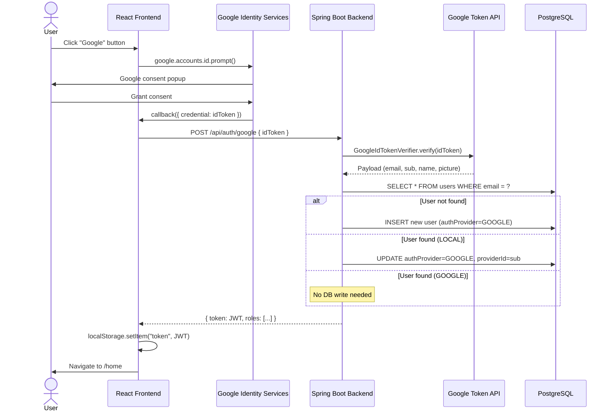

# Feature: Google OAuth Authentication

**Status**: 📋 Specified
**Author**: —
**Created**: 2026-05-15

---

## Summary

Enable users to sign in and register using their Google account. The flow uses Google Identity Services (GIS) on the frontend to obtain an ID token, which is sent to a new backend endpoint for verification, automatic user creation/linking, and JWT issuance.

---

## Motivation

- Reduce friction for new users — one-click sign-up instead of filling a registration form.
- Leverage Google's identity infrastructure for secure, passwordless authentication.
- Automatically link returning users who already have a LOCAL account with the same email.

---

## User Stories

| # | As a…        | I want to…                                              | So that…                                      |
|---|--------------|----------------------------------------------------------|-----------------------------------------------|
| 1 | New visitor  | Click "Google" on the login or register page             | I can create an account without a password     |
| 2 | Existing user| Click "Google" and have my account auto-linked           | I don't end up with duplicate accounts         |
| 3 | OAuth user   | Log in with Google on subsequent visits                  | I get a JWT just like a password-based user    |
| 4 | Admin        | See which auth provider a user used (LOCAL vs GOOGLE)    | I understand the user base composition         |

---

## Functional Requirements

### FR-1: Backend — Google ID Token Verification

- **Endpoint**: `POST /api/auth/google`
- **Request body**: `{ "idToken": "<Google ID token string>" }`
- **Behavior**:
  1. Verify the token using `google-api-client` (`GoogleIdTokenVerifier`) against the configured `GOOGLE_CLIENT_ID`.
  2. Extract `email`, `sub` (Google user ID), `name`, and `picture` from the token payload.
  3. Look up user by email:
     - **Not found** → auto-register (see FR-2).
     - **Found, provider = LOCAL** → auto-link (see FR-3).
     - **Found, provider = GOOGLE** → proceed to JWT generation.
     - **Found, `isActive = false`** → reject with error.
  4. Generate and return a JWT + role list in the standard `Response<LoginResponse>` envelope.
- **Response** (200 OK):
  ```json
  {
    "statusCode": 200,
    "message": "Google login successful",
    "data": {
      "token": "<JWT>",
      "roles": ["PARTICIPANT"]
    }
  }
  ```
- **Error cases**:
  - Invalid/expired token → `400 Bad Request`
  - Deactivated user → `404 Not Found` (matches existing convention)

### FR-2: Auto-Registration for New Google Users

When no user exists with the extracted email:
1. Derive a `username` from the email prefix (e.g. `john.doe@gmail.com` → `john_doe`). Sanitize non-alphanumeric characters to `_`.
2. If username already taken, append incrementing suffix (`john_doe1`, `john_doe2`, …).
3. Assign `PARTICIPANT` role by default.
4. Set `authProvider = "GOOGLE"`, `providerId = <Google sub>`, `password = null`.
5. Set `profileUrl` to Google's avatar URL if available.
6. Persist and proceed to JWT generation.

### FR-3: Auto-Linking for Existing LOCAL Users

When a user with `authProvider = "LOCAL"` is found with the same email:
1. Update `authProvider` to `"GOOGLE"` and set `providerId`.
2. If the user has no `profileUrl`, copy Google's avatar URL.
3. Preserve existing password (user can still log in with password).
4. Persist and proceed to JWT generation.

### FR-4: Frontend — Google Sign-In Button

- Both `LoginPage` and `RegisterPage` must render a "Google" social button.
- On click, trigger Google One Tap / GIS prompt.
- On receiving the credential callback, call `ApiService.loginWithGoogle(idToken)`.
- On success, store JWT + roles in `localStorage` and navigate to `/home` (or the redirect path).
- Show loading state while the request is in flight.

---

## Non-Functional Requirements

| ID    | Requirement                                                        |
|-------|--------------------------------------------------------------------|
| NFR-1 | Token verification must happen server-side only (never trust the client). |
| NFR-2 | The Google Client ID must be stored as an environment variable, never hardcoded. |
| NFR-3 | The GIS script must be loaded lazily (`async defer`) and cleaned up on component unmount. |
| NFR-4 | No new database migration script is required for new columns (`ddl-auto: update`), but the `password NOT NULL` constraint must be dropped via manual SQL. |

---

## Data Model Changes

### `users` table

| Column          | Type           | Change      | Notes                                        |
|-----------------|----------------|-------------|----------------------------------------------|
| `password`      | `VARCHAR(255)` | **MODIFY**  | Remove `NOT NULL` constraint (nullable for OAuth users) |
| `auth_provider` | `VARCHAR(20)`  | **ADD**     | Default `'LOCAL'`, not null. Values: `LOCAL`, `GOOGLE` |
| `provider_id`   | `VARCHAR(255)` | **ADD**     | Google `sub` claim. Nullable (null for LOCAL users) |

**Manual SQL migration** (required because Hibernate `update` won't drop constraints):
```sql
ALTER TABLE users ALTER COLUMN password DROP NOT NULL;
ALTER TABLE users ADD COLUMN IF NOT EXISTS auth_provider VARCHAR(20) DEFAULT 'LOCAL' NOT NULL;
ALTER TABLE users ADD COLUMN IF NOT EXISTS provider_id VARCHAR(255);
```

### `User.java` Entity Changes

```diff
- @NotBlank(message = "Password is required")
  private String password;

+ @Column(nullable = false)
+ @Builder.Default
+ private String authProvider = "LOCAL";
+
+ private String providerId;
```

### New Repository Method

```java
Optional<User> findByProviderIdAndAuthProvider(String providerId, String authProvider);
```

---

## API Specification

### `POST /api/auth/google`

**Authentication**: None (public endpoint, already covered by `/api/auth/**` permit in `SecurityConfig`).

#### Request

| Field     | Type   | Required | Description              |
|-----------|--------|----------|--------------------------|
| `idToken` | String | Yes      | Google GIS credential JWT |

#### Response — Success (200)

```json
{
  "statusCode": 200,
  "message": "Google login successful",
  "data": {
    "token": "eyJhbGciOiJIUzI1NiIs...",
    "roles": ["PARTICIPANT"]
  }
}
```

#### Response — Bad Request (400)

```json
{
  "statusCode": 400,
  "message": "Invalid Google ID token"
}
```

#### Response — Deactivated User (404)

```json
{
  "statusCode": 404,
  "message": "User not active, please contact customer support"
}
```

---

## Configuration

### Backend (`TDTUOJ_backend/.env`)

```
GOOGLE_CLIENT_ID=<your-google-cloud-oauth-client-id>
```

### Backend (`application.yml`)

```yaml
google:
  client:
    id: ${GOOGLE_CLIENT_ID}
```

### Frontend (`tdtuoj_frontend/.env`)

```
VITE_GOOGLE_CLIENT_ID=<same-client-id-as-backend>
```

### Backend Dependency (`pom.xml`)

```xml
<dependency>
    <groupId>com.google.api-client</groupId>
    <artifactId>google-api-client</artifactId>
    <version>2.7.2</version>
</dependency>
```

---

## Affected Files

### Backend

| File | Action | Description |
|------|--------|-------------|
| `pom.xml` | MODIFY | Add `google-api-client` dependency |
| `application.yml` | MODIFY | Add `google.client.id` config |
| `.env` | MODIFY | Add `GOOGLE_CLIENT_ID` |
| `User.java` | MODIFY | Remove `@NotBlank` on password, add `authProvider` + `providerId` fields |
| `AuthUser.java` | MODIFY | Handle null password in `getPassword()` |
| `UserRepository.java` | MODIFY | Add `findByProviderIdAndAuthProvider` method |
| `GoogleAuthRequest.java` | **NEW** | DTO for the google auth endpoint |
| `AuthService.java` | MODIFY | Add `loginWithGoogle` method signature |
| `AuthServiceImpl.java` | MODIFY | Implement `loginWithGoogle` (verify token, find/create user, generate JWT) |
| `AuthController.java` | MODIFY | Add `POST /google` endpoint |

### Frontend

| File | Action | Description |
|------|--------|-------------|
| `ApiService.js` | MODIFY | Add `loginWithGoogle(idToken)` method |
| `LoginPage.jsx` | MODIFY | Load GIS script, wire Google button to OAuth flow |
| `RegisterPage.jsx` | MODIFY | Same GIS integration as LoginPage |
| `.env` | CREATE | Add `VITE_GOOGLE_CLIENT_ID` |

---

## Sequence Diagram



---

## Verification Criteria

| # | Criterion | How to verify |
|---|-----------|---------------|
| 1 | Backend compiles | `mvn clean compile` succeeds |
| 2 | New user via Google | Click Google on login → new row in `users` with `auth_provider='GOOGLE'`, `password=NULL` |
| 3 | Existing user linking | Create LOCAL user, then Google-login with same email → `auth_provider` updated to `GOOGLE` |
| 4 | JWT works | After Google login, authenticated API calls succeed with the returned token |
| 5 | Deactivated user blocked | Set `is_active=false` in DB → Google login returns error |
| 6 | Invalid token rejected | Send garbage `idToken` → 400 response |
| 7 | Register page works | Google button on register page follows same flow |

---

## Open Questions

- **Q1**: Should we support unlinking Google (reverting to LOCAL with a new password)? → Deferred to a future spec.
- **Q2**: Should Google OAuth users be able to set a password later for dual-auth? → Deferred.
- **Q3**: Do we need a Google Cloud project setup guide for new developers? → Document in project README or onboarding docs.
