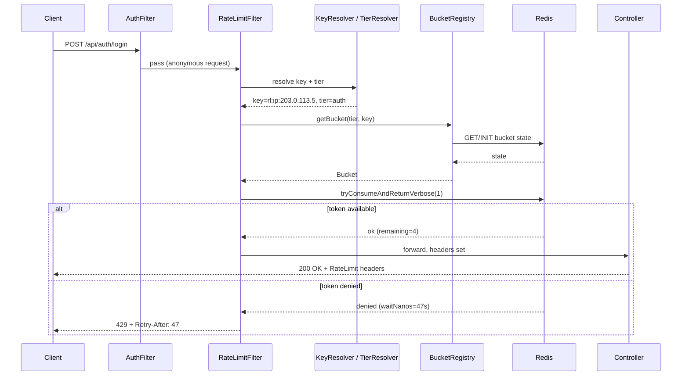

# Feature: API Rate Limiting

**Status**: 📋 Specified
**Author**: —
**Created**: 2026-05-15

---

## Summary

Add Redis-backed rate limiting in front of every REST endpoint exposed by `TDTUOJ_backend`. Anonymous traffic is throttled per client IP; authenticated traffic is throttled per user ID. Heavy or abuse-prone endpoints (auth, AI, submission, visualizer) receive tighter dedicated quotas. Over-quota requests are rejected with HTTP `429 Too Many Requests` and standard `X-RateLimit-*` / `Retry-After` headers.

---

## Motivation

- Prevent brute-force credential attacks on `/api/auth/login`, `/api/auth/register`, `/api/auth/google`.
- Prevent abuse of paid third-party calls (Gemini PDF extraction, hint generation, test-case generation).
- Prevent CPU exhaustion via the Judge0 submission queue and the visualizer instrumentation pipeline.
- Provide predictable behavior under load so a single misbehaving client cannot degrade the platform for others.
- Provide a single observable layer that emits structured rejection signals for monitoring / alerting.

---

## User Stories

| # | As a…           | I want to…                                          | So that…                                                |
|---|-----------------|------------------------------------------------------|---------------------------------------------------------|
| 1 | Backend dev     | Annotate or configure a per-endpoint quota          | I can tune limits without rewriting handlers            |
| 2 | Authenticated user | Receive a clear `429` with `Retry-After`         | My client can back off and retry sensibly               |
| 3 | Anonymous user  | Continue browsing public problem/contest lists      | A burst of writes elsewhere doesn't lock me out         |
| 4 | Admin           | Inspect current limiter counters in Redis           | I can diagnose throttling incidents                     |
| 5 | Security        | Detect repeated login failures from one IP          | We block credential-stuffing attempts                   |

---

## Functional Requirements

### FR-1: Global Servlet Filter

- A new `RateLimitFilter` (Spring `OncePerRequestFilter`) runs **after** `AuthFilter` so the authenticated principal (if any) is already resolved.
- Filter ordering: `AuthFilter` → `RateLimitFilter` → controller dispatch.
- Filter must be registered in the security chain via `addFilterAfter(rateLimitFilter, AuthFilter.class)` in `SecurityConfig`.
- Filter applies to **every** path under `/api/**` except actuator/swagger/openapi (see FR-7).

### FR-2: Key Resolution

The filter resolves the rate-limit key in the following priority order:

1. **Authenticated user** → key = `rl:user:{userId}`.
2. **Anonymous** → key = `rl:ip:{remoteAddr}`.
   - `remoteAddr` MUST honor the first entry of `X-Forwarded-For` when present (Judge0 dev setup runs behind no proxy, but production may sit behind nginx).
   - Validate the header is a well-formed IPv4/IPv6 to prevent header injection.

### FR-3: Tiered Quotas

Quotas are defined in `application.yml` and are loaded as `@ConfigurationProperties("ratelimit")`. Each tier specifies a **capacity** (max tokens) and a **refill window** (tokens per duration).

| Tier name        | Applies to                                                | Anonymous (per IP)    | Authenticated (per user) |
|------------------|-----------------------------------------------------------|-----------------------|--------------------------|
| `default`        | All endpoints not matched by a more specific tier         | 60 req / 60s          | 120 req / 60s            |
| `read-heavy`     | `GET /api/problems/**`, `GET /api/contests/**`, `GET /api/users/**`, `GET /api/organizations/**` | 120 req / 60s | 240 req / 60s |
| `auth`           | `POST /api/auth/login`, `POST /api/auth/register`, `POST /api/auth/google` | 5 req / 60s | 10 req / 60s |
| `submission`     | `POST /api/submissions`, `POST /api/submissions/**`       | 3 req / 60s           | 10 req / 60s             |
| `visualizer`     | `POST /api/visualize`                                     | 5 req / 60s           | 20 req / 60s             |
| `ai`             | `POST /api/hints`, `POST /api/problem-ai/**`              | 0 req / 60s (deny)    | 10 req / 60s             |
| `admin`          | `/api/admin/**` (any HTTP method)                          | n/a (auth required)   | 300 req / 60s            |

Notes:
- `ai` tier denies anonymous traffic entirely (anonymous can browse, never call paid LLM endpoints).
- A request is matched against the **most specific** path+method tier first; the `default` tier is the fallback.

### FR-4: Bucket Algorithm

- Use **token-bucket** semantics via `bucket4j-core` + `bucket4j-redis` (Lettuce backend).
  - Capacity = column "limit" above.
  - Refill = `Refill.greedy(capacity, window)` — drip-refill across the window, not a fixed-window reset (avoids edge bursts).
- A single Redis key per `(tier, principal-key)` pair stores the bucket state. Example: `rl:tier:auth:ip:203.0.113.5`.
- TTL on each Redis key = `2 * window` (auto-expire idle buckets).

### FR-5: Response Behavior

When `bucket.tryConsumeAndReturnVerbose(1)` succeeds:
- Continue the filter chain.
- Set headers on the response:
  - `X-RateLimit-Limit: {capacity}`
  - `X-RateLimit-Remaining: {remainingTokens}`
  - `X-RateLimit-Tier: {tierName}`

When it fails (no token available):
- Short-circuit: do NOT continue the chain.
- Set headers:
  - `X-RateLimit-Limit: {capacity}`
  - `X-RateLimit-Remaining: 0`
  - `X-RateLimit-Tier: {tierName}`
  - `Retry-After: {secondsUntilOneTokenAvailable}` (rounded up).
- Write a `Response<Void>` body (existing envelope from `common/response/Response`):
  ```json
  {
    "statusCode": 429,
    "message": "Rate limit exceeded. Try again in {n} seconds.",
    "data": null
  }
  ```
- HTTP status = `429`.
- Content-Type = `application/json`.

### FR-6: Per-Endpoint Override Annotation

- Provide a method-level annotation `@RateLimit(tier = "submission")` so a controller method can override the path-based mapping.
- Filter must locate the annotation via `HandlerMethod` resolution (use `RequestMappingHandlerMapping#getHandler(request)`).
- If both a path-pattern match and an annotation exist, the **annotation wins**.

### FR-7: Excluded Paths

The filter MUST bypass:
- `/swagger-ui/**`
- `/v3/api-docs/**`
- `/actuator/**`
- Static asset paths if any are served from Spring (currently none).

### FR-8: Fail-Open on Redis Outage

- If the Redis call throws `RedisConnectionFailureException` (or any `RedisSystemException`), the filter MUST log at `WARN` and let the request through.
- A metric `ratelimit.redis.errors` (Micrometer counter) MUST increment on each such failure.
- Rationale: limiter outage should not bring down the API; we'd rather lose throttling temporarily than serve 5xx broadly.

### FR-9: Admin Bypass (optional, default OFF)

- Config flag `ratelimit.admin-bypass: false`.
- When `true`, requests authenticated as `ADMIN` role skip the limiter entirely.
- Default OFF so admin tooling is still protected from runaway scripts.

---

## Non-Functional Requirements

| ID    | Requirement                                                                                            |
|-------|--------------------------------------------------------------------------------------------------------|
| NFR-1 | Limiter overhead per request ≤ 5 ms at p99 (one Redis round-trip via Lettuce).                         |
| NFR-2 | All bucket state is in Redis — instances must be horizontally scalable without sticky sessions.        |
| NFR-3 | No PII in Redis keys beyond user ID (numeric); IPs are stored hashed only if `ratelimit.hash-ip: true`.|
| NFR-4 | The filter must NOT consume the request body (consume tokens before any body parsing).                 |
| NFR-5 | Configuration is hot-reloadable via Spring `@RefreshScope` is NOT required (restart-time config is OK).|
| NFR-6 | Headers MUST comply with the IETF `draft-ietf-httpapi-ratelimit-headers` naming (`X-RateLimit-*`).      |

---

## Data Model Changes

None. Rate-limit state is ephemeral and lives in Redis.

---

## Configuration

### `application.yml`

```yaml
ratelimit:
  enabled: true
  admin-bypass: false
  hash-ip: false
  tiers:
    default:
      capacity: 60
      window-seconds: 60
      authenticated-capacity: 120
    read-heavy:
      capacity: 120
      window-seconds: 60
      authenticated-capacity: 240
      paths:
        - { method: GET, pattern: "/api/problems/**" }
        - { method: GET, pattern: "/api/contests/**" }
        - { method: GET, pattern: "/api/users/**" }
        - { method: GET, pattern: "/api/organizations/**" }
    auth:
      capacity: 5
      window-seconds: 60
      authenticated-capacity: 10
      paths:
        - { method: POST, pattern: "/api/auth/login" }
        - { method: POST, pattern: "/api/auth/register" }
        - { method: POST, pattern: "/api/auth/google" }
    submission:
      capacity: 3
      window-seconds: 60
      authenticated-capacity: 10
      paths:
        - { method: POST, pattern: "/api/submissions/**" }
    visualizer:
      capacity: 5
      window-seconds: 60
      authenticated-capacity: 20
      paths:
        - { method: POST, pattern: "/api/visualize" }
    ai:
      capacity: 0
      window-seconds: 60
      authenticated-capacity: 10
      paths:
        - { method: POST, pattern: "/api/hints" }
        - { method: POST, pattern: "/api/problem-ai/**" }
    admin:
      capacity: 0
      window-seconds: 60
      authenticated-capacity: 300
      paths:
        - { method: "*", pattern: "/api/admin/**" }
```

### `pom.xml` Dependencies

```xml
<dependency>
    <groupId>com.bucket4j</groupId>
    <artifactId>bucket4j-core</artifactId>
    <version>8.10.1</version>
</dependency>
<dependency>
    <groupId>com.bucket4j</groupId>
    <artifactId>bucket4j-redis</artifactId>
    <version>8.10.1</version>
</dependency>
<dependency>
    <groupId>io.micrometer</groupId>
    <artifactId>micrometer-core</artifactId>
</dependency>
```

(`micrometer-core` is already transitively present via `spring-boot-starter-actuator`; listed for clarity.)

---

## Affected Files

### Backend

| File | Action | Description |
|------|--------|-------------|
| `pom.xml` | MODIFY | Add `bucket4j-core` + `bucket4j-redis` deps |
| `application.yml` | MODIFY | Add the `ratelimit:` block above |
| `common/ratelimit/RateLimitProperties.java` | **NEW** | `@ConfigurationProperties("ratelimit")` POJO |
| `common/ratelimit/TierConfig.java` | **NEW** | Inner POJO: `capacity`, `windowSeconds`, `authenticatedCapacity`, `List<PathRule> paths` |
| `common/ratelimit/PathRule.java` | **NEW** | `{ String method; String pattern; }` |
| `common/ratelimit/RateLimit.java` | **NEW** | Method-level annotation `@RateLimit(tier = "...")` |
| `common/ratelimit/RateLimitKeyResolver.java` | **NEW** | Resolves principal key (user vs IP) from `HttpServletRequest` |
| `common/ratelimit/RateLimitTierResolver.java` | **NEW** | Maps `(method, path, handlerMethod)` → tier name. Annotation > path rule > `default`. |
| `common/ratelimit/BucketRegistry.java` | **NEW** | Provides `Bucket` instances backed by `LettuceBasedProxyManager`. Caches `BucketConfiguration` per tier. |
| `common/ratelimit/RateLimitFilter.java` | **NEW** | `OncePerRequestFilter` orchestrating resolver → registry → consume → headers/429. |
| `common/ratelimit/RateLimitMetrics.java` | **NEW** | Micrometer counters: `ratelimit.allowed`, `ratelimit.denied{tier}`, `ratelimit.redis.errors`. |
| `common/security/SecurityConfig.java` | MODIFY | `addFilterAfter(rateLimitFilter, AuthFilter.class)` + permit pre-existing exclusions. |
| `common/config/RedisConfig.java` | MODIFY | Expose `LettuceBasedProxyManager<String>` bean for Bucket4j. |

### Tests

| File | Action | Description |
|------|--------|-------------|
| `RateLimitFilterTest.java` | **NEW** | Spring MVC test: 5 rapid `POST /api/auth/login` → 5th returns 429 with `Retry-After`. |
| `RateLimitTierResolverTest.java` | **NEW** | Unit test of path-pattern → tier matching and annotation override. |
| `BucketRegistryIntegrationTest.java` | **NEW** | Testcontainers Redis; verify TTL, refill, distributed correctness. |

### Frontend

| File | Action | Description |
|------|--------|-------------|
| `services/ApiService.js` | MODIFY | Add a global Axios response interceptor: on `status === 429`, read `Retry-After`, surface a toast `"Too many requests, retry in {n}s"`, and reject. |
| `components/common/ToastMessage.jsx` | NONE | Reuse existing toast — no change. |

---

## API Specification — Common 429 Response

Any endpoint may now return:

```http
HTTP/1.1 429 Too Many Requests
Content-Type: application/json
X-RateLimit-Limit: 5
X-RateLimit-Remaining: 0
X-RateLimit-Tier: auth
Retry-After: 47

{
  "statusCode": 429,
  "message": "Rate limit exceeded. Try again in 47 seconds.",
  "data": null
}
```

OpenAPI/Swagger: register `429` as a shared response in `springdoc` via `GlobalExceptionHandler` so it appears on every operation.

---

## Sequence Diagram



---

## Verification Criteria

| # | Criterion | How to verify |
|---|-----------|---------------|
| 1 | Backend compiles | `./mvnw clean compile` succeeds |
| 2 | Filter wired into chain | `curl -i /api/problems` returns `X-RateLimit-Limit` header |
| 3 | Anonymous login throttled | 6 rapid `POST /api/auth/login` from one IP → 6th = 429 with `Retry-After` |
| 4 | Authenticated submission throttled | 11 rapid `POST /api/submissions` from one user → 11th = 429 |
| 5 | AI denied anonymously | Anonymous `POST /api/hints` → 429 immediately |
| 6 | AI allowed for user | Authenticated `POST /api/hints` succeeds up to 10/min |
| 7 | Tier annotation override | A controller method annotated `@RateLimit(tier="auth")` enforces auth quota even on a path not matching the auth pattern |
| 8 | Redis outage fail-open | Stop Redis container → API still serves 200, log shows `ratelimit.redis.errors` increment |
| 9 | Admin bypass off by default | Admin user is still rate-limited under `admin` tier (300/min) |
| 10 | Excluded paths not throttled | `/actuator/health` and `/swagger-ui/index.html` never return 429 |
| 11 | Frontend toast | Trigger a 429 from devtools — UI shows "Too many requests" toast |
| 12 | Headers conform | Response includes `X-RateLimit-Limit`, `X-RateLimit-Remaining`, `Retry-After`, `X-RateLimit-Tier` |

---

## Rollout Plan

1. **Phase 1 — shadow mode**: deploy with `ratelimit.enabled: true` but `capacity` values set to `10x` real values. Log denials only; do not return 429. Collect baseline traffic per tier for 1 week.
2. **Phase 2 — enforce auth + AI tiers only**. Other tiers remain in shadow.
3. **Phase 3 — enforce all tiers** with tuned values from Phase 1 data.
4. **Phase 4 — add admin dashboard** (deferred) to inspect top throttled keys.

---

## Open Questions

- **Q1**: Per-organization quotas (e.g., a whole university burns through their AI quota together)? → Deferred; userId scoping is enough for v1.
- **Q2**: Should we surface remaining quota in a profile UI panel? → Deferred.
- **Q3**: Distributed sliding-window vs token-bucket — picked token-bucket for Bucket4j maturity; revisit if burst behavior is undesirable.
- **Q4**: Do we need separate read/write quotas per tier, or is method-based path matching enough? → Current spec uses method+pattern; sufficient for v1.
- **Q5**: Should `429` increment a security event for the auth tier (lockout after N denials)? → Out of scope; handle in a future "account lockout" spec.

---

## Test Results — 2026-05-16

Tested via k6 (`tests/k6/`) against backend on `localhost:8090` with Redis on `localhost:6379`.

### Verification Criteria Results

| # | Criterion | Status | Method | Notes |
|---|-----------|--------|--------|-------|
| 1 | Backend compiles | ✅ Pass | `./mvnw clean compile` | Clean build, no errors |
| 2 | Filter wired into chain | ✅ Pass | k6 `04-headers-check.js` | `X-RateLimit-Limit/Remaining/Tier` on `GET /api/problems`, `/api/contests`, `/api/users` |
| 3 | Anonymous login throttled | ✅ Pass | k6 `01-auth-throttle.js` | Reqs 1–5 pass, req 6 → 429 + `Retry-After`, `tier=auth`, `limit=5` |
| 4 | Authenticated submission throttled | ✅ Pass | k6 `03-submission-throttle.js` (with credentials) | Reqs 1–10 pass, req 11 → 429, `tier=submission`, `limit=10` |
| 5 | AI denied anonymously | ✅ Pass | k6 `02-ai-deny-anon.js` | `/api/hints` + `/api/problem-ai/**` → immediate 429, `limit=0`, `tier=ai` |
| 6 | AI allowed for authenticated user | ✅ Pass | k6 `05-ai-authed-quota.js` | Token bucket consumed correctly across 10 requests; req 11 → 429. Gemini responses timed out (slow LLM) but tokens were consumed before controller — expected behavior per NFR-4 |
| 7 | Tier annotation override | ✅ Pass | Code inspection `RateLimitTierResolver.java:28–33` | `@RateLimit` annotation checked first via `HandlerMethod`; returns `annotation.tier()` before any path matching |
| 8 | Redis outage fail-open | ✅ Pass | Manual (`docker stop redis` + `curl`) | `GET /api/problems` returned 200 with no `X-RateLimit-*` headers; backend logged `WARN ratelimit.redis.errors`; no 5xx |
| 9 | Admin bypass off by default | — Skipped | — | Default config `admin-bypass: false` confirmed in `application.yml`; live burst test deferred |
| 10 | Excluded paths not throttled | ✅ Pass | k6 `04-headers-check.js` | `/actuator/health` + `/swagger-ui/index.html` → 200, no `X-RateLimit-Tier` header |
| 11 | Frontend toast on 429 | ✅ Pass | Manual browser test | Toast "Too many requests, retry in Xs" displayed on 429 response |
| 12 | Headers conform | ✅ Pass | k6 `04-headers-check.js` | `X-RateLimit-Limit`, `X-RateLimit-Remaining`, `X-RateLimit-Tier`, `Retry-After` all present and correctly valued |

**Result: 11/12 passed. VC9 skipped (config-level confidence sufficient for v1).**

### Observations & Fixes

- **[FIXED]** Login endpoint (`POST /api/auth/login`) was returning 404 for non-existent users — leaking user existence (user enumeration). Fixed: `AuthServiceImpl` now throws `UnauthorizedAccessException` ("Invalid email or password") for both missing email and wrong password → 401. Inactive account returns 400. Same fix applied to Google login path.
- **[FIXED]** `run-all.ps1` was invoking `03-submission-throttle.js` with `$baseEnv` (anonymous) even when credentials were provided, so VC4 (authenticated submission throttle) never ran in the full suite. Fixed: script now passes `$authEnv` to test 03 when `-Email` and `-Password` are supplied.
